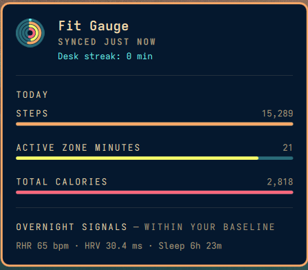
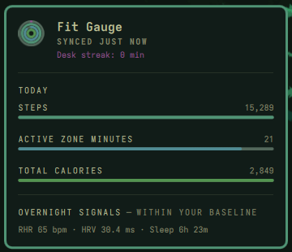
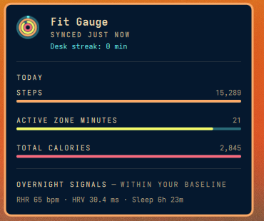
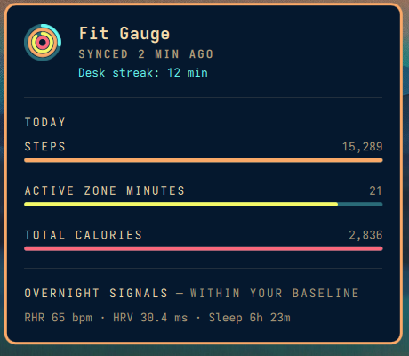
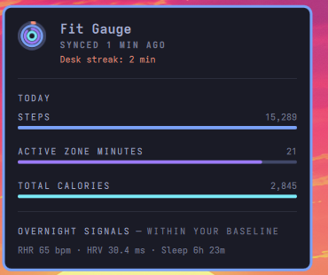

# Fit Gauge

Fit Gauge is a Quickshell bar widget that reads a user's own Fitbit data through the official Google Health API. It requires user-provided Google OAuth credentials and a local Python environment with the documented dependencies. OAuth credentials are stored in the local system keyring; no credentials are bundled with the plugin. Desktop movement notifications are opt-in and respect Omarchy Do Not Disturb. The plugin does not overwrite user configuration without explicit user action.

An Omarchy bar plugin that shows your Fitbit stats at a glance — steps, Active Zone Minutes, and calories as a small gauge in the bar. Click it for a popup with the per-metric breakdown, an overnight recovery summary, and (opt-in) desk-context nudges.


## Screenshots

**Bar icon** — three concentric fill rings, one per hero metric vs. today's goal (order/metrics configurable, see [Settings](#settings)).


**Popup** — click the icon for today's 3 hero metrics as fill bars, plus an "Overnight Signals" line comparing resting heart rate, HRV, and sleep against your own 14-day baseline.



**Nudges** (opt-in, off by default) — a plain desktop notification, automatically silenced by Do Not Disturb.


When data goes stale (a missed sync, a network hiccup), the rings and bars desaturate in place rather than showing an error screen.

### Themes

Colors are derived from your active Omarchy theme's accent (hue-rotated per ring), not hardcoded — and the popup follows your bar's placement, left or top:

<table>
<tr>
<td align="center"><br><sub>Osaka Jade</sub></td>
<td align="center"><br><sub>Retro (top bar)</sub></td>
<td align="center"><br><sub>Retro (left bar)</sub></td>
<td align="center"><br><sub>Tokyo</sub></td>
</tr>
</table>

## Why

The job this does: zero-context-switch fitness awareness while you're stuck at the dev machine.

What this explicitly is **not**: a Fitbit app replacement, a historical dashboard, or a source of naggy notifications — the two nudges below are opt-in and minimal, off by default.

## Status

v0.1 (glance-only bar gauge + popup) and v0.2 (opt-in desk-context nudges) are both complete and in daily use. See the [issue tracker](https://github.com/prinse84/fit-gauge/issues) for open polish/exploration items.

## Settings

No settings GUI (a CLI is all this needs for now) — configure via `omarchy bar set`:

```
omarchy bar set prinse84.fit-gauge <key> <value>
```

| Key | What it does | Default |
|---|---|---|
| `ring1Metric` | Outer ring / first popup row | `Steps` |
| `ring2Metric` | Middle ring / second popup row | `Active Zone Minutes` |
| `ring3Metric` | Inner ring / third popup row | `Total Calories` |
| `stepGoal` | Daily step goal | `11000` |
| `azmGoal` | Daily Active Zone Minutes goal | `24` |
| `calorieGoal` | Daily calorie goal (total burn - BMR + activity, not active-only) | `2300` |
| `distanceGoalMeters` | Daily distance goal, in meters (shown as miles) | `8851` (5.5 mi) |
| `floorsGoal` | Daily floors-climbed goal | `11` |
| `refreshIntervalSec` | How often data is refetched | `300` |
| `sedentaryNudge` | Opt-in. `On` sends a desktop notification when you've been continuously active at the desk (not idle) for a while — independent of step count. Respects Do Not Disturb. | `Off` |
| `nudgeSedentaryMinutes` | How long a continuous active stretch before the stand-up nudge can fire | `45` |
| `paceNudge` | Opt-in. `On` sends at most one notification per day if you're meaningfully behind a research-informed step pace for the time of day. Independent of `sedentaryNudge`. Respects Do Not Disturb. | `Off` |
| `paceNudgeMarginPercent` | How far below expected pace (as a percent of the expected value) before the behind-pace nudge fires | `20` |

`ring1Metric`/`ring2Metric`/`ring3Metric` each accept one of: `Steps`, `Active Zone Minutes`, `Total Calories`, `Distance`, `Floors`. Multi-word values need quoting:

```
omarchy bar set prinse84.fit-gauge ring1Metric "Active Zone Minutes"
```

Distance and Floors aren't a v0.1 focus — they're available if you want them, but weren't part of the default design, and Floors in particular depends on your Fitbit device reporting that data at all (not every device has a barometric altimeter).

### Nudges

Both nudges are desktop notifications (`notify-send`), off by default, and automatically silenced by Do Not Disturb — Omarchy's own shell is the notification server, so DND is handled for free, no extra setting needed here.

- **Stand-up nudge** (`sedentaryNudge`) fires once per continuous desk stretch once you cross `nudgeSedentaryMinutes`, and re-arms only after you actually take a break (not on a timer).
- **Behind-pace nudge** (`paceNudge`) fires at most once a day if your steps are behind a pace curve modeled on published step-accumulation research (three daily peaks — commute/lunch/evening — with dips at typical desk hours), by more than `paceNudgeMarginPercent`.

## Roadmap

- [x] **v0.1 — Glance**
  - [x] Bar gauge showing 3 hero metrics (steps / Active Zone Minutes / calories vs. goal)
  - [x] Popup with per-metric breakdown, resting heart rate, sleep duration, last-synced time
  - [x] Passive states: desaturate on stale data
- [x] **v0.2 — Desk-context nudges**
  - [x] Stand-up nudge: prompt to move after a long continuous sedentary stretch (opt-in)
  - [x] Behind-pace nudge: once-a-day prompt if steps are meaningfully behind a research-informed pace for the time of day (opt-in)
- [ ] **v1.0 — More opt-in notifications**
  - [ ] Sync-lag and goal-completion notifications
- [ ] **v2.0+ — Nerd-tier (opt-in / drill-down only, never default-visible)**
  - [ ] Trend sparklines, streaks, sleep-stage breakdown, theme-colored gauges

## Requirements

- [Omarchy](https://github.com/basecamp/omarchy) (Quickshell-based bar)
- A Fitbit account synced to Google Health
- Python 3.10+ and [`uv`](https://docs.astral.sh/uv/) (or plain `venv`/`pip`)
- Your own Google Cloud project with the Google Health API enabled and an OAuth 2.0 client (free — see Setup below)

## Setup

Each installer registers their own Google Cloud OAuth client — there's no shared/hosted client, so this step can't be skipped. It's a one-time setup, about 10 minutes.

### 1. Create a Google Cloud project and enable the API

1. Go to the [Google Cloud console](https://console.cloud.google.com/) and create a new project (or pick an existing one).
2. Enable the Google Health API directly at [console.developers.google.com/apis/library/health.googleapis.com](https://console.developers.google.com/apis/library/health.googleapis.com) — confirm the right project is selected, then click **Enable**.

### 2. Configure the OAuth consent screen

The Google Health API's scopes are all "Restricted," which normally requires a Google security review — but that review only applies to a *published/verified* app. Skip it entirely by keeping the app in Testing mode with yourself as the only user:

1. In the console, go to **APIs & Services → OAuth consent screen**.
2. User type: **External**.
3. Fill in the required app name/support email fields, then publish nothing — leave **Publishing status: Testing**.
4. Under **Test users**, add the Google account you'll actually authenticate with (the one linked to your Fitbit device via Google Health).

### 3. Create an OAuth 2.0 client

1. Go to [console.developers.google.com/apis/credentials](https://console.developers.google.com/apis/credentials) → **Create Credentials → OAuth client ID**.
2. Application type: **Desktop app** (not Web application — this project runs the installed-app/PKCE flow, not a web redirect).
3. Create it, then download the client JSON.
4. Save it as `~/.config/fit-gauge/client_secret.json`.

### 4. Install the plugin (without enabling it yet)

```sh
omarchy plugin add https://github.com/prinse84/fit-gauge
```

This clones it to `~/.config/omarchy/plugins/prinse84.fit-gauge` but leaves it disabled — deliberately, so the next two steps happen with a human at the keyboard rather than the bar widget's background process attempting them silently on its own first run.

### 5. Install Python dependencies

`Service.qml` expects the Python interpreter at this exact path, so create the venv there (not elsewhere, and not inside the plugin folder — a venv's symlinks fail Omarchy's plugin validator if nested inside a plugin directory):

```sh
cd ~/.config/omarchy/plugins/prinse84.fit-gauge
uv venv ~/.cache/fit-gauge/venv
uv pip install --python ~/.cache/fit-gauge/venv/bin/python -r requirements.txt
```

(No `uv`? `python3 -m venv ~/.cache/fit-gauge/venv && ~/.cache/fit-gauge/venv/bin/pip install -r requirements.txt` works the same.)

### 6. Authenticate once, by hand

Still in that same directory:

```sh
~/.cache/fit-gauge/venv/bin/python fitbit_status.py
```

This opens a browser for you to sign in and approve the requested scopes (steps/activity, health metrics, sleep). It should print one JSON line with your steps/AZM/calories/etc. and no `warnings`. Your token is then stored in `gnome-keyring`, not on disk.

### 7. Enable it

```sh
omarchy plugin enable prinse84.fit-gauge --section right
```

(`--section left`/`--section center` work too, if you'd rather place it elsewhere.) Then optionally tune goals/metrics/nudges via `omarchy bar set` — see [Settings](#settings) above.

## Disclaimer

Fit Gauge is an independent, community project. It is not affiliated with, endorsed by, or sponsored by Fitbit or Google. Fitbit data is accessed only through the official Google Health API, under your own Google Cloud OAuth credentials.

## License

MIT — see [LICENSE](LICENSE).
